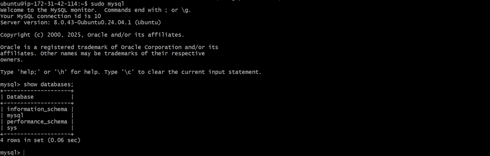
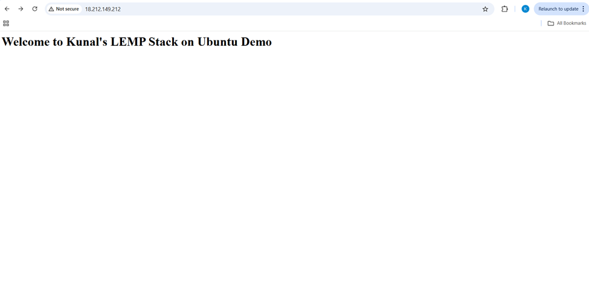
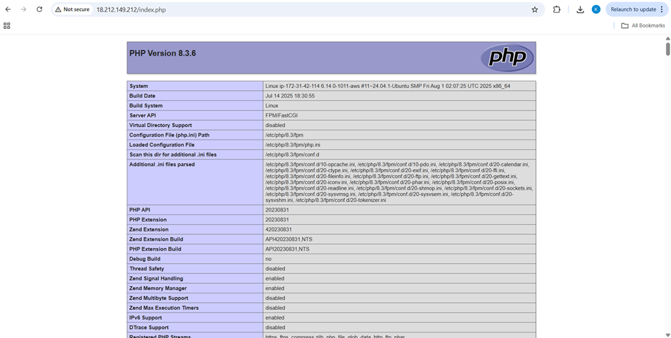

# LEMP Stack Deployment on Ubuntu

*"Step-by-Step into Web Hosting, Setting Up My First LEMP Environment"*  

---

## Overview  
LEMP stands for **Linux, Nginx, MySQL, and PHP**. It is one of the most widely used open-source stacks for hosting dynamic websites and web applications. In this guide, we will set up Nginx as the web server, MySQL as the database, and PHP-FPM as the scripting language on an Ubuntu server.

---

## Prerequisites  
- An Ubuntu EC2 instance   
- Security Group / Firewall rules allowing inbound traffic on:  
  - **Port 22 (SSH)** for remote access  
  - **Port 80 (HTTP)** for Nginx web server  
- Basic knowledge of Linux commands  
- Public IP of your server for browser testing  

---

## Steps to Deploy  

### 1. Update Packages  
```bash
sudo apt update && sudo apt upgrade -y
````

### 2. Install Required Packages

```bash
sudo apt install nginx mysql-server php-fpm php-mysql -y
```

### 3. Start and Enable Services

```bash
sudo systemctl start nginx mysql php8.3-fpm
```

### 4. Verify Service Status

```bash
sudo systemctl status nginx mysql php8.3-fpm
```

If unsure about service names:

```bash
ls /usr/lib/systemd/system | grep -i <pkg-installed>
```

### 5. Test Nginx with HTML

* Create a simple HTML file:

```bash
sudo vim /var/www/html/index.html
```

* Add sample content, save and exit.
* Test:

```bash
curl localhost
```

### 6. Test PHP

* Create a PHP file:

```bash
sudo vim /var/www/html/index.php
```

* Add:

```php
<?php phpinfo(); ?>
```

* Test:

```bash
curl localhost/index.php
```

### 7. Verify MySQL

```bash
sudo mysql
SHOW DATABASES;
```


### 8. Browser Test

Open your server’s public IP in a browser:

* `http://<PUBLIC_IP>`  should show HTML page


* `http://<PUBLIC_IP>/index.php` should show PHP info page


---

## Result

You now have a fully working **LEMP stack** on Ubuntu, capable of serving both static (HTML) and dynamic (PHP + MySQL) web pages.

---

## Tech Stack

* **OS**: Ubuntu (Linux)
* **Web Server**: Nginx
* **Database**: MySQL
* **Backend**: PHP
* **Hosting**: AWS EC2

---

## Summary

We are deploying a LEMP environment on Ubuntu. The flow is straightforward: update packages → install Nginx, MySQL, and PHP-FPM → start and enable services. Once installed, you can test Nginx by creating a custom HTML page and PHP by creating an index.php file with `phpinfo()`. You also verify MySQL by logging into the database and listing schemas. The final check is accessing your server’s public IP in a browser to ensure both static and dynamic pages load correctly.

---

